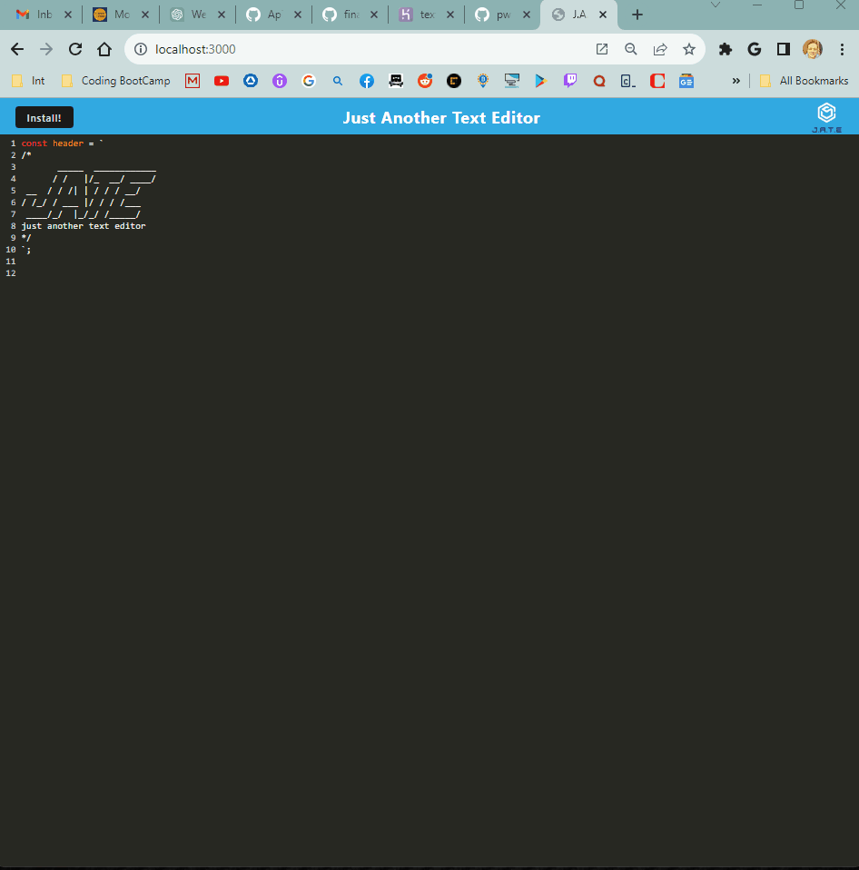

# 📝 Text Editor - Progressive Web App 🏗️

## Technology Used 👷‍♂️

 <p float="left">


</p>

## Description 📝
This project is a Text Editor with a beautiful color interface.  It can be used to take notes or save code snippets with or without an internet connection.  

This project is a progressive web app (PWA).  A PWA is a type of web application that utilizes modern web technologies to provide an app-like experience for users. One of the things that make PWA’s special is that they can work with varying levels of network connectivity, including offline mode. They use service workers to cache important resources and provide a reliable user experience even when the device is offline or has a poor network connection.  This App utilizes this and even has an “install” feature so that the user can install the Text Editor directly to their machine and be able to use it completely offline. 

[Go to the deployed application on Heroku](https://text-editor-pwa916-e253ae17fce3.herokuapp.com/) 👀

## Table of Contents 📑

* [Usage](#usage)
* [Learning Points](#learning-points)
* [Author Info](#author-info)
* [License](#license)

## Usage ⏯️
  To use the application from the command line (after installing dependencies):
1. Open the root directory of the repository in your terminal or bash.
2. Bundle the front-end code by entering ```npm run build``` in the command line.
3. Start the server by entering ```npm run start``` in the command line.
4. Go to the port on your local host.
5. Click the "Install" button.




## Learning Points 🧑‍🏫

  
To create this application, I used:

1. IndexedDB (via the idb package) as a database.  idb is a lightweight wrapper around the IndexDB API.  
2. Webpack to bundle front-end code
3. Workbox to create a service worker that caches static assets
And, Heroku.


## Author Info 🙋‍♂️
### Steven Sills II
Thanks for taking a look at this project! If you would like to see more of my work or contact me please use the links below. 

<a href="mailto: stevensills2@gmail.com" target="_blank"></a>
<a href="https://www.linkedin.com/in/steven-sills-ii-90781b53/" target="_blank"></a>
<a href="https://apixa25.github.io/steven-sills-portfolio/" target="_blank"></a>

## License

[](https://opensource.org/licenses/MIT)
MIT License

Copyright (c) 2023 Steven Sills II

Permission is hereby granted, free of charge, to any person obtaining a copy
of this software and associated documentation files (the "Software"), to deal
in the Software without restriction, including without limitation the rights
to use, copy, modify, merge, publish, distribute, sublicense, and/or sell
copies of the Software, and to permit persons to whom the Software is
furnished to do so, subject to the following conditions:

The above copyright notice and this permission notice shall be included in all
copies or substantial portions of the Software.

THE SOFTWARE IS PROVIDED "AS IS", WITHOUT WARRANTY OF ANY KIND, EXPRESS OR
IMPLIED, INCLUDING BUT NOT LIMITED TO THE WARRANTIES OF MERCHANTABILITY,
FITNESS FOR A PARTICULAR PURPOSE AND NONINFRINGEMENT. IN NO EVENT SHALL THE
AUTHORS OR COPYRIGHT HOLDERS BE LIABLE FOR ANY CLAIM, DAMAGES OR OTHER
LIABILITY, WHETHER IN AN ACTION OF CONTRACT, TORT OR OTHERWISE, ARISING FROM,
OUT OF OR IN CONNECTION WITH THE SOFTWARE OR THE USE OR OTHER DEALINGS IN THE
SOFTWARE.
